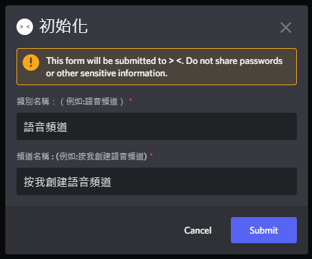
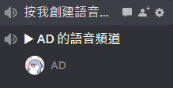
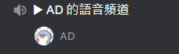

# 動態語音頻道(dvc)

## 初始化
使用 `/dvc setup`，然後會跳出一個表單，之後按下送出就可以了  

## 如何使用
只需要加入剛才機器人創建的語音頻道就可以了  

## 限制人數
使用 `/dvc setlimit [數字]`  

## 限制人數
使用 `/dvc limit [數字]` ，但是這個是設定個別的語音頻道用的  

## 鎖定
使用 `/dvc lock` ，讓別人沒辦法進入你的語音頻道  

## 解除鎖定
使用 `/dvc unlock` ，讓別人能夠進入你的語音頻道  

## 拒絕某個人進入你的語音頻道
使用 `/dvc reject [@一個人]` ，讓某個人沒辦法進入你的語音頻道  

## 拒絕某個人進入你的語音頻道
使用 `/dvc permit [@一個人` ，讓某個人可以進入你的語音頻道  

## 更改頻道名稱
使用 `/dvc name [名稱]` ，可以改掉語音頻道的名子  
