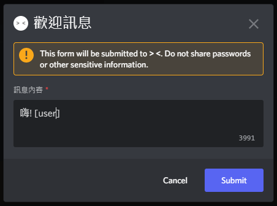

# 歡迎訊息

## 初始化
使用 `/welcomer [#頻道]`，然後會跳出一個表單，接著按下送出就可以了  

## 語法
我不知道這個算不算語法啦

| 語法                    | 用途           |
|-----------------------|--------------|
| [user]                | @加入的那個人      |
| [user_id]             | 加入的那個人的id    |
| [user_name]           | 加入的那個人的名子    |
| [user_discriminator]  | 加入的那個人#後面的數字 |
| [user_avatar_url]     | 加入的那個人的頭像    |
| [user_bot]            | 加入的那個人是否為機器人 |
| [user_joined_at]      | 加入的時間        |
| [member_count]        | 目前成員的數量      |
| [owner]               | 伺服器擁有者       |
| [owner_id]            | 伺服器擁有者的id    |
| [server_verification] | 伺服器的驗證等級     |
| [server_name]         | 伺服器名稱        |
| [server_id]           | 伺服器的id       |
